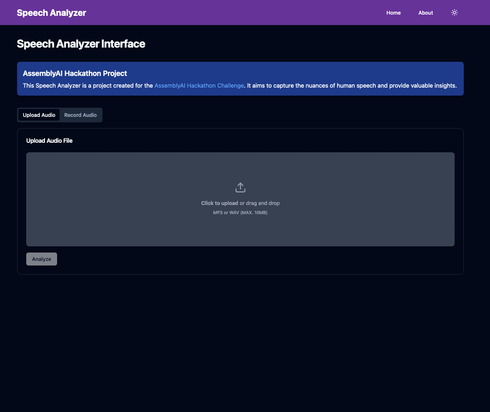
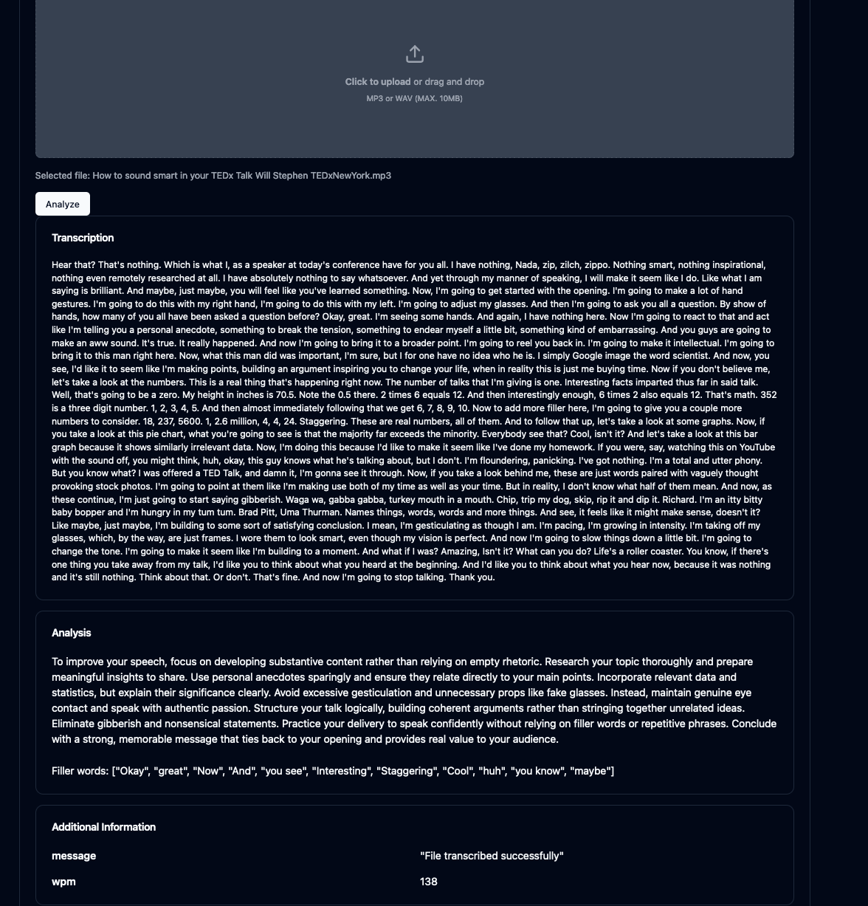

# assembly-ai-challenge

This is my submission for [Dev.to and AssemblyAI Challenge](https://dev.to/devteam/join-us-for-the-assemblyai-challenge-and-capture-the-nuance-of-human-speech-3000-in-prizes-4g4f?bb=189417).

## Technical requirements
This project needs:
- Python 3.8 or higher
- Node.js and npm
- ffmpeg (will be installed by the script if possible)

## Idea of the project.
I created a simple website where you can get tips on how to better your public speaking.

You have two choices, either upload an audio clip or record something on the spot. When you have created the samples you want transcribed and to get tips on, you can upload the file. Then the program will give you tips on how to make the speech better, and give you a list of filler words that you should avoid.

## How to run

1. Run the `initialize_env.sh` script. It will surprisingly initialize the environment with downloading everything needed for Back- and Frontend.
2. Open a terminal session, with the possibility of splitting sessions/windows.
3. `cd BACKEND`
4. `./start.sh`
5. Split the terminal window, or open a new session.
6. `cd FRONTEND`
7. `npm run dev`
